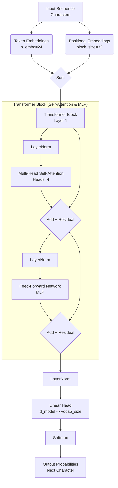

# Gpt From Scratch 🚀

A lightweight, character-level Generative Pre-trained Transformer (GPT) built from scratch to classify system logs. This project demonstrates the core principles of Transformers, Autograd, and Language Modeling in a compact, educational implementation.

## 🎥 Demo

[](https://youtu.be/yQqBtnar_2k)

## 📂 Project Structure

```bash
gpt/
├── Dataset/
│   └── logs_5000.txt             # The training dataset (5000 unique log samples)
├── Notebook/
│   └── log_classifier_microgpt.ipynb  # The main notebook containing the model & training code
├── README.md                     # Project documentation (this file)
└── assets/                       # Demo videos and architecture diagrams
```

## 🧠 Model Architecture

This model is a decoder-only Transformer, similar to GPT-2, but scaled down for educational purposes. It processes data at the **character level**, meaning it learns to predict the next character in a sequence without needing a word-based tokenizer.

### Diagram



### Key Parameters
| Parameter | Value | Description |
| :--- | :--- | :--- |
| **Type** | Decoder-Only | Generative Transformer |
| **Tokenization** | Character-level | No external tokenizer needed |
| **`n_embd`** | 24 | Dimension of embeddings |
| **`n_head`** | 4 | Number of attention heads |
| **`n_layer`** | 1 | Number of Transformer blocks |
| **`block_size`** | 32 | Maximum context length (window size) |
| **`vocab_size`** | ~65 | Unique characters in dataset |

## 🛠️ Implementation Details

### 1. Custom Autograd Engine
Instead of using PyTorch's `autograd`, this project implements a custom `Value` class that builds a dynamic computation graph. It handles:
- Forward pass (data flow)
- Backward pass (automatic differentiation via chain rule)
- Topological sort for gradient propagation

### 2. Training Loop
- **Optimizer**: Custom Adam implementation (`lr=0.01`, `beta1=0.9`, `beta2=0.99`).
- **Loss Function**: Cross-Entropy Loss (Negative Log Likelihood).
- **Steps**: 1,000 training steps.
- **Backprop**: Gradients are calculated specifically for the character-level objectives.

## 📊 Dataset
The dataset (`Dataset/logs_5000.txt`) consists of 5,000 synthetically generated, realistic system logs labeled with `INFO`, `WARNING`, or `ERROR`.
- **Format**: `<Log Message> -> <Label>`
- **Example**: `redis-cache connection timed out globally -> ERROR`

---
## 📝 Author

**Shubham Murtadak** - *(AI & ML Engineer)*  

[LinkedIn](https://www.linkedin.com/in/shubham-murtadak-287991237/)
